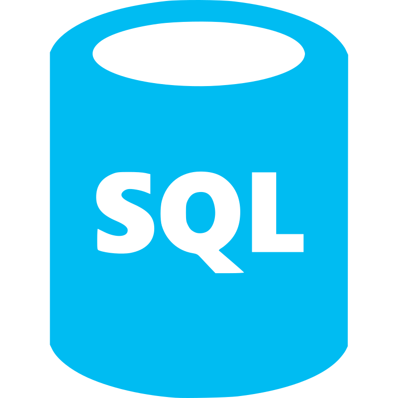

### Welcome, I'm KLaHD 👋

## I'm a Data Engineer!

- 🖥️ Specialize in Data Engineering and Web Development!
- 🎓 Graduated: University of Information Technology - Vietnam's National University of Ho Chi Minh City (VNUHCM)
-  Pursuing MSc in Computer Science @ University of Information Technology - Vietnam's National University of Ho Chi Minh City (VNUHCM)
- 💯 2024 Goals: Learning new Cloud technology like AWS, Databrick, Machine Learning models, LLM like GPT (Natural Language Processing).

### Contact me:

[][facebook]
[][twitter]
[][instagram]
[][email]

 

### Technologies I'm using:

#### Languages

  <code></code>
  <code></code>
  <code></code>
  <code></code>
  <code></code>

#### Data processing (Batch/Streaming)

    <code></code>
    <code></code>
    <code></code>

#### Cloud technologies

    <code></code>
    <code></code>

#### Web development

    <code></code>
    <code></code>
    <code></code>

---

[facebook]: https://www.facebook.com/profile.php?id=100010304493276
[twitter]: https://twitter.com/LangHuynhDangK2
[instagram]: https://www.instagram.com/tkhoa882/
[email]: tkhoa882@gmail.com
